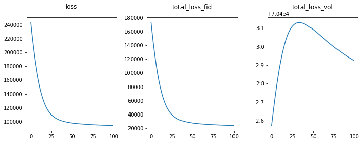

# Single Shell Free Water Elimination Diffusion Tensor Model 

This is a Python implementation of a Single Shell Free Water Elimination Model
for analysis of Diffusion Tensor MRI Images. It implements the methods in the
references below to solve an optimization problem over a Riemannian Manifold
via gradient descent. **This software is written for educational purposes
only**.

|  |
|:---:| 
| *Free Water corrected Fractional Anisotropy* |

## Software requirements

This code was developed with the following versions. It might also work on slightly older versions of `Python`.

* Python 3.6.3
* [Dipy 0.14.0](http://nipy.org/dipy/index.html)

## Getting Started

* Download via git. `git checkout https://github.com/sameerd/DiffusionTensorImaging.git`
* Follow one of the two examples
  * [example.py](example.py) : how to use this code in a script or pipeline with your own data.
  * [Example.ipynb](notebooks/Example.ipynb) Jupyter Notebook has an interactive overview of how to use this repository with publicly available data
* Check that the first panel (marked `loss` below) converges

If the model isn't converging you can try reducing the time step `dt` or
increase the number of iterations. Once you are sure about convergence, you can
use the the code's convenience functions to return the `free water map`, the
free water corrected `mean diffusivity`, and the free water corrected
`Fractional Anisotropy` (visualized above).  

## Documentation

* This [README](README.md) file has an overview of how to use this repository. 
* The [SingleShellFreewater.pdf](./doc/SingleShellFreeWater.pdf) file helps describe what the code is doing in the language of mathematics and ties it to the reference papers.
* The core of the implementation is in the [freewater.py](./pymods/freewater.py) file and the interface class in [freewater\_runner.py](./pymods/freewater_runner.py).

## Caveats
* **This software is untested. Please do your own testing before using it.**

* There is a separate effort by @mvgolub and @RafaelNH to put in an expanded
single shell model into the [Dipy](http://nipy.org/dipy/index.html)
repository. Please follow along at the [Dipy Issue Tracker
#827](https://github.com/nipy/dipy/issues/827). When the Dipy version is ready,
it is likely to be better tested, more user friendly, efficient and have more
features than the version in this repository.

## Memory Usage

On a recent test a smallish volume of size 100x100x10 with approx 200 gradient
directions consumes around 3GB of memory and takes approximately 30 minutes to
run. A more realistically sized volume will take longer and consume more
memory. Try to make sure that there is enough memory to prevent swapping to
disk. 

## References

* Pasternak, O. , Sochen, N. , Gur, Y. , Intrator, N. and Assaf, Y. (2009), Free water elimination and mapping from diffusion MRI. Magn. Reson. Med., 62: 717-730. doi:[10.1002/mrm.22055](https://doi.org/10.1002/mrm.22055)

* Pasternak O., Maier-Hein K., Baumgartner C., Shenton M.E., Rathi Y., Westin CF. (2014) The Estimation of Free-Water Corrected Diffusion Tensors. In: Westin CF., Vilanova A., Burgeth B. (eds) Visualization and Processing of Tensors and Higher Order Descriptors for Multi-Valued Data. Mathematics and Visualization. Springer, Berlin, Heidelberg doi:[10.1007/978-3-642-54301-2\_11](https://doi.org/10.1007/978-3-642-54301-2_11)

